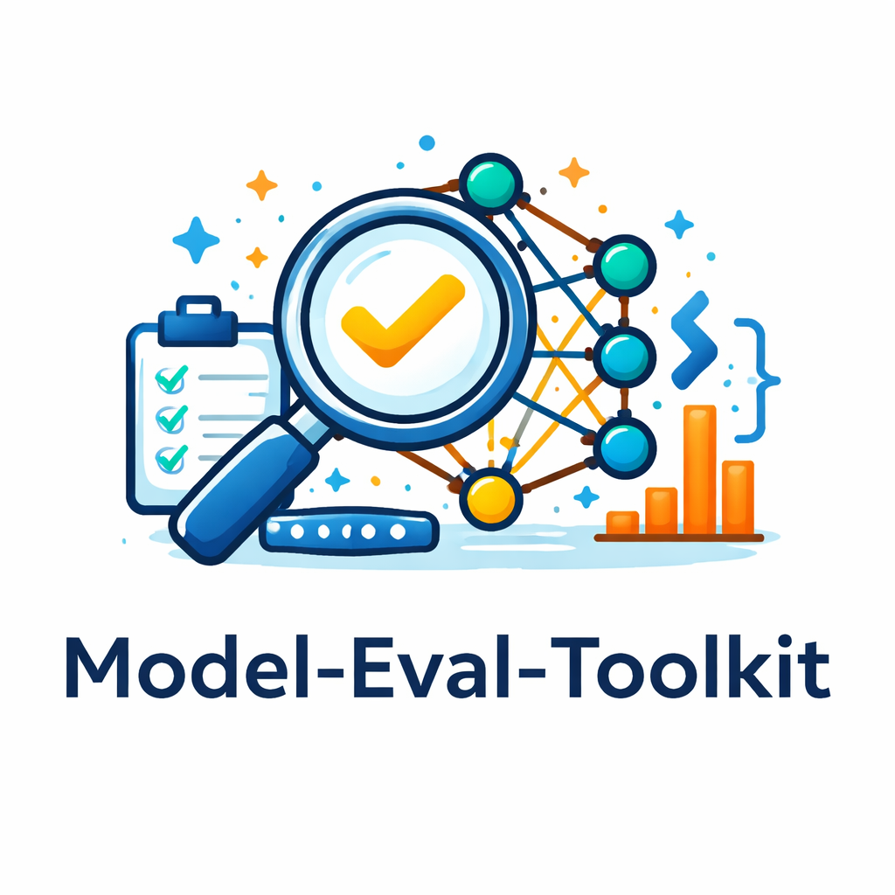

<p align="center">
  
</p>

# Model Eval Toolkit — Documentation

**PyPI:** [`model-eval-toolkit`](https://pypi.org/project/model-eval-toolkit/) · **Import:** `evalreport`

Unified evaluation reports for machine learning: metrics, plots, narrative insights, and exports to HTML, JSON, Markdown, and PDF.

---

## Contents

| Guide | Description |
|--------|-------------|
| [Getting started](getting-started.md) | Install, optional extras, first report in 60 seconds |
| [`generate_report` reference](generate-report.md) | All parameters, defaults, return value, file layout |
| [Task inference (`task="auto"`)](task-inference.md) | How the library guesses classification vs regression, NLP, CV, ranking |
| [Supported tasks](tasks.md) | Per-task inputs, metrics, plots, and code examples |
| [Output formats](output-formats.md) | HTML, JSON, Markdown, PDF behavior |
| [API overview](api-overview.md) | Task-specific report classes and shared `BaseReport` pattern |
| [Development & contributing](development.md) | Local setup, tests, releases, CI |

---

## At a glance

| Area | Support |
|------|---------|
| **Tabular** | Classification (binary / multiclass), regression, clustering |
| **Time series** | Forecasting metrics and rolling diagnostics |
| **NLP** | Text classification, text generation (reference vs hypothesis) |
| **Vision** | Image classification, segmentation (masks), object detection (boxes + mAP) |
| **Ranking** | MAP, Precision/Recall/NDCG/Hit@K, cumulative gain plots |
| **Exports** | HTML (rich), JSON, Markdown, PDF (ReportLab) |

---

## Quick example

```python
from evalreport import generate_report

generate_report(
    task="classification",
    y_true=[0, 1, 0, 1],
    y_pred=[0, 1, 1, 1],
    y_prob=[0.2, 0.9, 0.7, 0.6],
    output_path="reports/my_report.html",
)
```

Plots are written next to your report under `evalreport_plots/` (see [generate-report.md](generate-report.md)).

---

## Links

- [Repository](https://github.com/RAAHUL-tech/model-eval-toolkit)
- [Issues](https://github.com/RAAHUL-tech/model-eval-toolkit/issues)
- [PyPI](https://pypi.org/project/model-eval-toolkit/)
